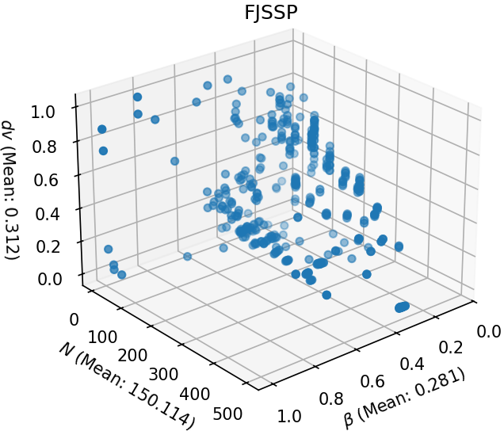
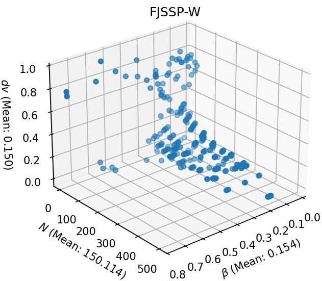
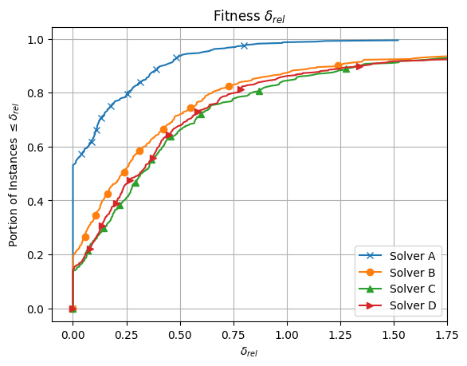
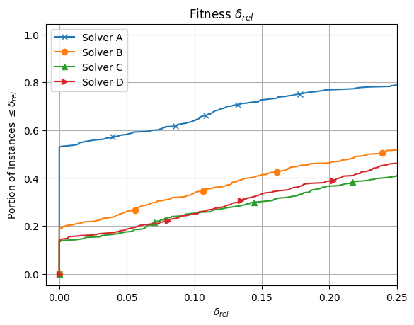
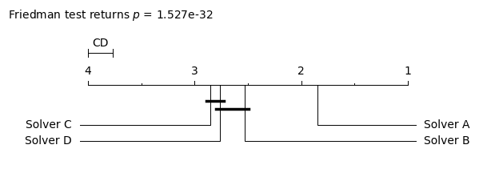
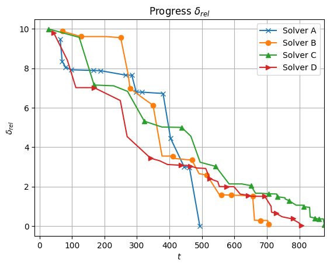
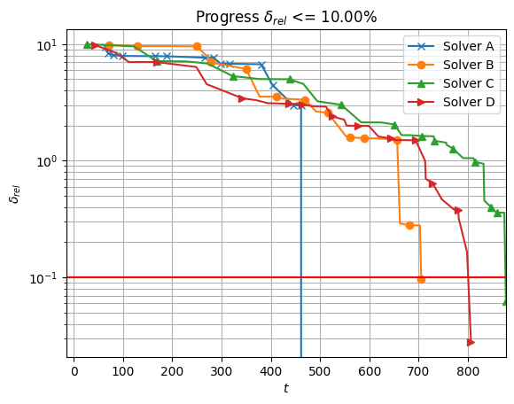

# FJSSP and FJSSP-W Benchmarking Environment
This provided environment can be used to test and compare different algorithms for the flexible job shop scheduling problem (FJSSP) and the FJSSP with worker flexibility (FJSSP-W). The provided benchmark instance collection can be found in the "instances" subdirectory, including some example instances for the FJSSP-W. Also provided in the directory "InstanceData" are known best results and lower bounds for the different problems and their instances.
"util" contains the provided evaluation and comparison functionality of the benchmarking environment, including the algorithm used to create FJSSP-W problem instances from the well known FJSSP instances.

## FJSSP-W Benchmarking Instances

Note that while a translation algorithm between FJSSP and FJSSP-W instances is provided, the FJSSP-W instances are generated randomly (based on the respective FJSSP instance). The provided best known results for the FJSSP-W are specific to the FJSSP-W instances which are provided and can not not be used for comparison with newly generated instances.

## Structure
The repository is divided into the [util](https://github.com/jrc-rodec/FJSSP-W-Benchmarking/tree/main/util) and [instances](https://github.com/jrc-rodec/FJSSP-W-Benchmarking/tree/main/instances) subsections, as well as the example files in the root directory.

### Util
The util section contains the provided APIs for comparison and evaluation.
The provided APIs include an algorithm to translate FJSSP to FJSSP-W instances, methods for visualization and comparison of results, evaluation metrics, and utilities to load and parse both FJSSP and FJSSP-W benchmark instances into python objects.
Additionally, to establish a baseline for comparison, a greedy solver is included which can solve the given benchmark problems.

### Instances
The instances section containts the problem instances, including example FJSSP-W instances created by the translation algorithm provided in the util section.
Additionally, the [InstanceData](https://github.com/jrc-rodec/FJSSP-W-Benchmarking/tree/main/instances/InstanceData) subfolder contains data about the benchmark instances and their characteristics, as well as a collection of known best results (lower bound (LB) and upper bound (UB)). The upper bound represents the best found feasible result. If the lower bound and upper bound of an instance are equal, it can be assumed to be the optimal result.

### Examples
The example files demonstrate different aspects of the benchmarking environment to help with the understanding of the provided APIs.

## Benchmark Selection
The benchmarking environment offers a filter option that allows benchmark instances to be selected according to the desired benchmark properties. 

FJSSP Overview           |  FJSSP-W Overview
:-------------------------:|:-------------------------:
 | 

The figures displayed above show the distribution of benchmark instances in relation to some of the filterable problem properties, for the provided FJSSP and FJSSP-W instances. There are several clusters of instances that are very similar in these characteristics. To efficiently test how well an algorithm applies to the more general problem, it may be desirable to first select only representatives of the clusters to save computation time and generate the most representative subset of instances possible to avoid potential biases in the results analysis.
The filterable features include the number of operations $\texttt{N}$, the number of machines, the number of workers, the flexibility $\beta$, the duration variety $dv$, the number of orders $n$, and various other features. Each characteristic can optionally be filtered with a predefined lower and upper limit for problem cases to be included in the experiments. This option is available for both the supplied FJSSP and FJSSP-W instances.

## Benchmark Preparation
Based on the provided filters (if any), the requested benchmarks can be loaded using built-in functions. The loading process returns all requested instances and provides several APIs to read their data. This includes the job sequence, which shows how many operations belong to each job, including their fixed position for the assignment vectors, the duration matrix $T$, the amount of operations $\texttt{N}$, machines $m$, worker $w$, and several other characteristics.

## Benchmark Experiments
The provided best results, both for the FJSSP and FJSSP-W, were retrieved from a combination of state-of-the-art solvers and a GA [Hutter2024](https://doi.org/10.1109/CEC60901.2024.10611934). The experiments to get the results were processed on the same test computer (Intel Core i7-6700 (3.40GHz) CPU with 16 GB RAM, Windows 10) with a time limit of 20 minutes. Note that for the FJSSP-W, only the best known results for the provided instances are given. If other FJSSP-W instances are generated, they are not comparable to the provided best known results. The visualization methods provided by the benchmarking environment can be used to visualize any metrics, though for comparison with the provided best known results the makespan is required as objective function. The best found lower bounds by the used solvers are also provided and can be compared. For the comparison of specific problem instances a progress plot can be created. This requires a record of the desired metrics over time in the form of a list. The list elements should contain tuples with the first entry being the timestamp of the record and the second being the recorded value. This data can be used by the visualizer to produce a comparative plot.

Note that for solvers with a stochastic nature like metaheuristics, multiple experiments per problem instance should be performed to receive conclusive results. The minimum recommended amount of independent algorithm repetitions is 20. This represents a slight reduction from the usually recommended number of about 30 repetitions for statistically relevant results [Vecek2017](doi.org/10.1016/j.asoc.2017.01.011) and is due to the high computational effort for solver execution on the individual instances.
To this end, it appears useful to speed up the duration of the experiments by carrying out the individual runs in parallel.
However, the process of parallelization is left to the user of the benchmark environment and is not shown in the usage examples below, since parallelized approaches can not be tracked automatically. Yet, the best results and the average optimization results can be formatted into the required format and used with the provided visualization tools.

## Performance Evaluation
The benchmark environment offers an evaluation function for the makespan to ensure the final solution is evaluated correctly. As input for the evaluation, the start times, the machine assignments and the worker assignments (in case of the FJSSP-W) are required in the fixed order provided by the benchmarking environment. A translation between the encoding used in [Hutter2024](https://doi.org/10.1109/CEC60901.2024.10611934) for both the FJSSP and the FJSSP-W is available.
For comparisons to other solvers, the benchmark environment offers different visualizations of the results summarized over all used benchmark instances. The data of the evaluated solvers are included and best known results can be updated over time. Additionally, the benchmarking environment offers an API to calculate the MiniZinc score for comparison. A demonstration can be found in the provided examples below.

Result Overview           |  Zoomed-in Result Overview
:-------------------------:|:-------------------------:
 | 

The example result plots are shown in the plot above. For each compared scheduling algorithm, the illustration visualizes the proportion of problem instances that can be solved up to a given deviation from the best-known results on such instances. To this end, for each instance, the relative deviation, or gap, $\delta_{rel}$ of a solver's final best solution $C_{fb}=C(\mathbf{y}_{fb})$ from the best-known result $C_{best}$ on a particular instance is calculated

$\delta_{rel} = \frac{C_{fb} - C_{best}}{C_{best}}$

All instances that could be solved within the deviation $\delta_{rel}$ are then counted.
Finally, the ratio of instances solved within the gaps is then plotted against the respective $\delta_{rel}$ values.

For multiple solvers, the algorithm performance is considered to be better the closer the curve runs along the vertical axis. In such cases, larger proportions of the instances are solved with comparatively smaller deviations from the best-known solution.
While the figure on the left demonstrates a general overview of the performance differences among four exemplary solvers, the figure on the right zooms into the lower left part of the results in the first figure to focus on more subtle performance differences between solvers. One observes that Solver A exhibits the best performance as it realizes the best-known solution on approximately $55\%$ of the instances. On the contrary, Solver C shows the poorest performance.
Note that this representation is not suitable for drawing conclusions about the performance on individual instances but concentrates exclusively on the proportion of instances that could be solved to a given quality.

As can be seen in the figure, it can happen that some performance lines do not reach $\delta_{rel} = n1.0$. This happens if not all solvers could find feasible solutions for all the included instances. The visualizer is implemented in a way that it can handle missing data for the case in the example.

### MiniZinc Score and Statistical Significance Testing
In addition to the performance plots above, the benchmarking environment provides further performance indicators for comparing the tested solvers on all instances of both problem types (FJSSP or FJSSP-W). On the one hand, the suite offers the option of generating an overall score for the results of all benchmark instances, following the example of the annual MiniZinc Competition [MiniZinc](https://challenge.minizinc.org/) of constraint programming solvers [Stuckey2014](https://doi.org/10.1609/aimag.v35i2.2539). On the other hand, the rankings of the benchmarked solvers are computed and tested for statistically significant differences using a Friedman test as the omnibus test and, if applicable, the Nemenyi test for pairwise post-hoc investigations [Hollander2013](doi.org/10.1002/9781119196037).

| FJSSP-W solver   | Solver A | Solver B | Solver C | Solver D |
|-------------------------|----------|----------|----------|----------|
| MiniZinc score | 866.0    | 590.0    | 460.0    | 496.0    |

The so-called MiniZinc score is a summarized measure of the mutual performance of the compared solvers across all selected instances of a problem type. The score is calculated by comparing the results of each solver relative to the results of all other solvers on each instance. On every instance, a solver receives one point for every solver that achieves a worse solution quality or infeasible results. In case of an equal solution quality, the time required to achieve the result is also considered. In that case, the two compared solvers split the point weighted by their time to achieve the result. The maximum score of a solver is bound by the number of instances times the number of compared solvers minus 1, i.e.

$MiniZinc score  \leq  \\# instances \times \left( \\# solvers -1 \right).$

For the example data used in the demonstration plots, the MiniZinc Score of the four solvers A to D is determined and displayed in the result table above. Considering the comparison of 4 solvers and the use of 402 instances the maximum score of a solver becomes 1206. 

For the purpose of a statistically sound statement about the significance of the performance differences, the compared solvers are ranked on the individual instances. The distributions of these ranks are then examined for significant differences using a Friedman test at the confidence level of $\alpha=5\%$. If the $p$-value returned by the Friedman test is below $\alpha$, there is an indication of significant differences.  
Consequently, a Nemenyi test is performed to make a pairwise comparison. The results of the statistical tests between all solvers are summarized in a Nemenyi diagram. 
 *A Nemenyi diagram based on the example data using 4 solvers for 402 problems.*
 
THe figure above shows an example of a Nemenyi diagram for the four considered example solvers A to D
together with the resulting $p$-value returned by the corresponding Friedman test. From left to right, the diagram 
orders the compared algorithms from inferior to superior ranks. It displays the average ranking of each solver as well as the critical distance $CD$ that needs to be exceeded to indicate a statistically significant performance difference. Below the range of admissible ranks, bold black lines connect the solvers that did not produce
statistically significant differences. As can be seen in the figure above,
 Solver A significantly outperforms the remaining three methods, while Solver C and Solver D produce statistically indistinguishable results. At the same time, Solver B and D do not show significant differences. Yet, Solver B exhibits a significantly better performance than Solver C.

### Single instance evaluation
The plots shown below display the progress of a solver on a selected individual instance over time $t$ (measured in seconds). The example plots shows the relative deviation $\delta_{rel}$ of the best solution found by each solver from the best solution observed by all considered solvers in the left figure. Accordingly, the solver that first reaches $\delta_{rel} = 0$ exhibits superior performance in terms of speed (i.e., Solver A in the provided example).

Progress $\delta_{rel}$          |  Progress $\delta_{rel} \le 10\%$
:-------------------------:|:-------------------------:
 | 

The right figure displays the $\delta_{rel}$ dynamics towards a user-defined deviation (here 10\%) from the best-known solution (here provided by Solver A).
This target deviation is specified by the user and can be provided to the visualization tool as a parameter. 

Within the example data, all solvers reach the threshold distance to the best result in the given plots. However, if not all solvers reach the best result or get within the specified threshold, not all lines might intersect the horizontal solid red line. 
This can also happen if a limit on the horizontal axis is imposed on the plot. Note that not all solvers start at $t = 0$, since only feasible solutions are considered for the visualization of the dynamics.

## References for the included FJSSP problems
1. P. Brandimarte. Routing and Scheduling in a Flexible Job Shop by Tabu Search. Annals of Operations Research, 41(3):157–183, 1993.
2. J. Hurink, B. Jurisch, and M. Thole. Tabu search for the job-shop scheduling problem with multi-purpose machines. Operations-Research-Spektrum, vol. 15, no. 4, pp. 205–215, 1994.
3. S. Dauzère-Pérès and J. Paulli. Solving the General Multiprocessor Job-Shop Scheduling Problem. Technical report, Rotterdam School of Management, Erasmus Universiteit Rotterdam, 1994.
4. J. B. Chambers and J. W. Barnes. Flexible Job Shop Scheduling by Tabu Search. The University of Texas, Austin, TX, Technical Report Series ORP96-09, Graduate Program in Operations Research and Industrial Engineering, 1996.
5. I. Kacem, S. Hammadi, and P. Borne. Pareto-Optimality Approach for Flexible, Job-Shop Scheduling Problems: Hybridization of Evolutionary Algorithms and Fuzzy Logic. Mathematics and Computers in Simulation, 60(3-5):245–276, 2002.
6. P. Fattahi, M. S. Mehrabad, and F. Jolai. Mathematical Modeling and Heuristic Approaches to Flexible Job Shop Scheduling Problems. Journal of Intelligent Manufacturing, 18(3):331–342, 2007.
7. Behnke, D., & Geiger, M. J. (2012). Test instances for the flexible job shop scheduling problem with work centers. Arbeitspapier/Research Paper/Helmut-Schmidt-Universität, Lehrstuhl für Betriebswirtschaftslehre, insbes. Logistik-Management.
